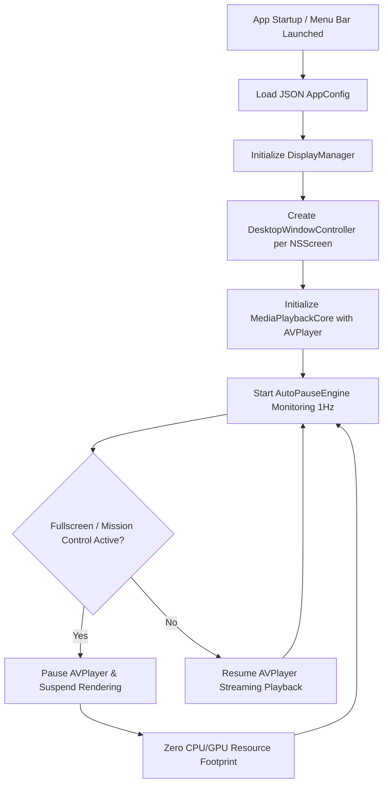

# System Architecture & Flowchart

## Overview

DynamicWallpaperEngine is structured as a modular, layered native macOS architecture.

```
 +-------------------------------------------------------------------------+
 |                            User Interface                               |
 |   - SwiftUI GUI Manager (Library, Settings, Plugin Store, Log Viewer)   |
 |   - Menu Bar Control (NSStatusItem / AppKit Menu)                       |
 +-------------------------------------------------------------------------+
                                    |
                                    v
 +-------------------------------------------------------------------------+
 |                           App Controller Core                           |
 |   - StateManager (App lifecycle, Config JSON schema & migration)        |
 |   - AutoPauseEngine (Mission Control, Stage Manager, Fullscreen detector) |
 |   - DisplayManager (Multi-monitor workspace topology & hotplug)         |
 +-------------------------------------------------------------------------+
         |                                           |
         v                                           v
 +----------------------------------+   +----------------------------------+
 |       Wallpaper Engine           |   |       Plugin System              |
 | - DesktopWindow (AppKit Level)   |   | - QuickJS C-Bridge               |
 | - MediaPlaybackCore              |   | - JS Runtime Context             |
 |   (AVPlayer / VideoToolbox /    |   | - Canvas / Overlay Renderer      |
 |    FFmpeg fallback)              |   | - Event Bus & Native APIs        |
 +----------------------------------+   +----------------------------------+
```

---

## Playback Lifecycle & Auto-Pause Flowchart


