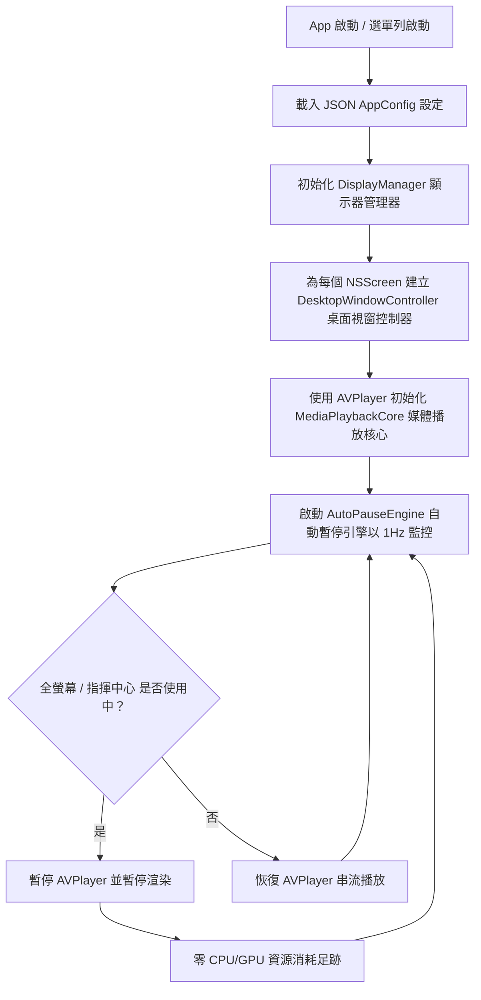

[English](../../docs/ARCHITECTURE.md) | [繁體中文](ARCHITECTURE.md)

# 系統架構與流程圖

## 概觀

DynamicWallpaperEngine 採用模組化、分層式的 macOS 原生架構。

```
 +-------------------------------------------------------------------------+
 |                              使用者介面                                 |
 |   - SwiftUI GUI 管理器 (資料庫、設定、外掛商店、日誌檢視器)             |
 |   - 選單列控制 (NSStatusItem / AppKit 選單)                             |
 +-------------------------------------------------------------------------+
                                    |
                                    v
 +-------------------------------------------------------------------------+
 |                             應用程式核心                                |
 |   - 狀態管理器 StateManager (App 生命週期, 設定 JSON 綱要與遷移)        |
 |   - 自動暫停引擎 AutoPauseEngine (指揮中心, 幕前調度, 全螢幕偵測)       |
 |   - 顯示器管理器 DisplayManager (多螢幕工作空間拓撲與熱插拔)            |
 +-------------------------------------------------------------------------+
         |                                           |
         v                                           v
 +----------------------------------+   +----------------------------------+
 |           桌布引擎               |   |           外掛系統               |
 | - DesktopWindow (AppKit 層級)    |   | - QuickJS C-Bridge               |
 | - MediaPlaybackCore              |   | - JS Runtime Context             |
 |   (AVPlayer / VideoToolbox /    |   | - Canvas / 疊加層渲染器          |
 |    FFmpeg 備用方案)              |   | - 事件匯流排 & 原生 API          |
 +----------------------------------+   +----------------------------------+
```

---

## 播放生命週期與自動暫停流程圖


